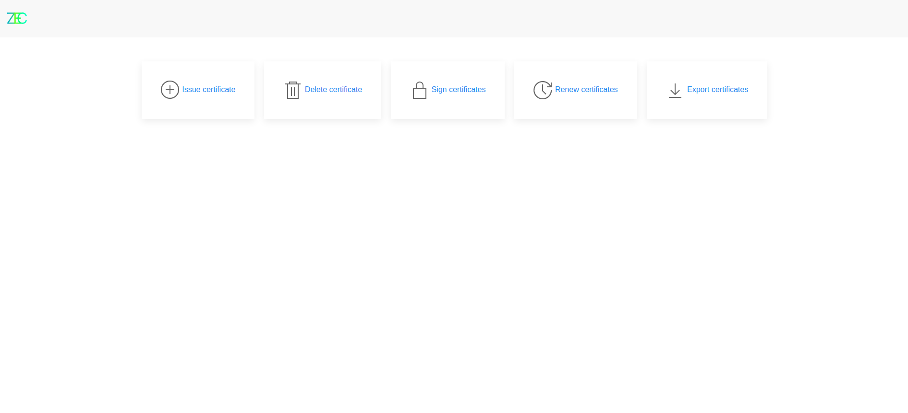
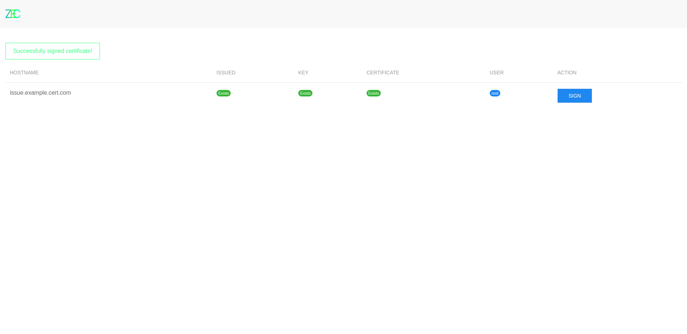
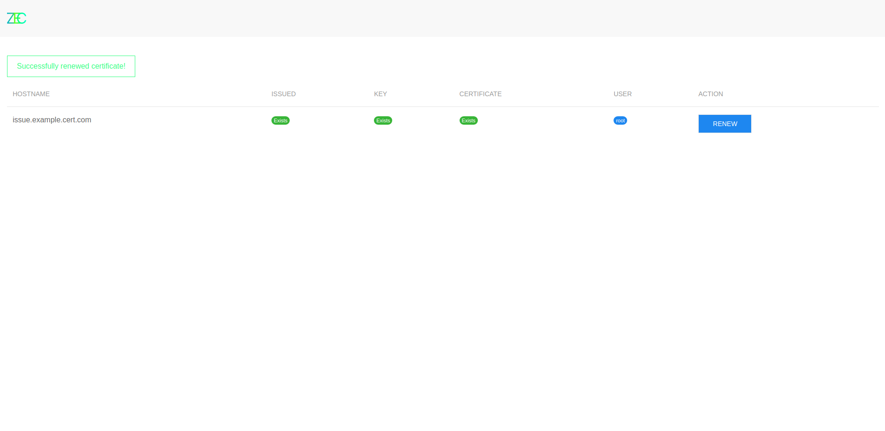

# Getting started.

## 1. Pre-Installation
To install it you need to execute this commands:

```bash
sudo apt install php #if it is php7.3, 7.4, 7.5..., then ok. if not, there is the link below
sudo apt install openssl -y
#in future versions:
#sudo apt install php-mysql php-sqlite
```

## 2. Cloning repo
Then you can download repo to your website directory.
```bash
cd /your/website/directory
git clone https://github.com/cajemam/ZECertAuthPanel.git
```

## 3. Configuring CA root certificate
> In beta version you can install only one root certificate due to the small database, but in future version, I will try to create a multiple CA Authority.
```bash
cd ZECertAuthPanel
chmod +x startup.sh
./startup.sh
```

Then you will be asked to enter some info about your Certification Authority and it will generate root CA certificate and some config files for your future administration panel.
> **Important!** Please do not delete template files like init.php.template and opensslconf.temp after installation. When migrating to a new directory you will need to regenerate openssl.cnf.

## 4. Using administation panel.
Get to the login page at [https://localhost:7783](https://localhost:7783).

There you will start configuring your users.
The first user, that will be tried to login, will be created in the users table in the database with "Administrator" rights.
Other users, that will be tried to login, will be created in the users table in the database with "User" rights.
After logging in, you will get to the administration panel.



## 5. Creating new certificate
Then get to issue page to create a new certificate. This will create a private key and csr.


## 6. Signing certificate
To sign the certificate and create a .crt file, get to the "Sign certificate" page.



## 7. Renewing certificate
Renewing certificate deleted the previous certificate and generates a new one instead of the previous. To renew it get to the "Renew certificate" page.


## 8. Exporting certificate
To export certificate get to The "Export certificate" page.
There you can export the csr, private key and certificate.
[!Exported](images/export.png)